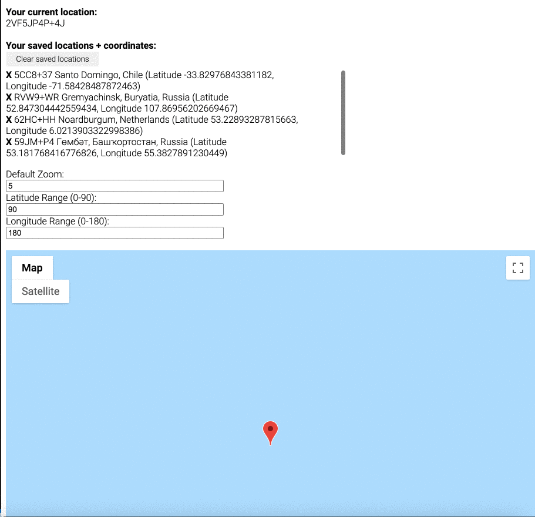

# Random Location Generator + Tracker #

## Overview ##
This app allows the user to generate and travel to a random location on an interactive, zoomable map, using the Google Maps API.

If the user likes the random location they've ended up in, clicking the marker pin will save that location to a list that includes the latitude and longitude coordinates for future reference.

This app was built with React, Express.js, Node.js, and MongoDB, as well as the Google Maps API.

## How To Get Started ##
```
npm install
npm run dev
npm start
```

You must also obtain a Google Maps API Key by following the steps at the below link. Store the key in a new file API_KEY.js as shown in the API_KEY.sample.js file. The file should be automatically .gitignored.

[Get Google Maps API Key](https://developers.google.com/maps/documentation/javascript/get-api-key)

## Demo ##
